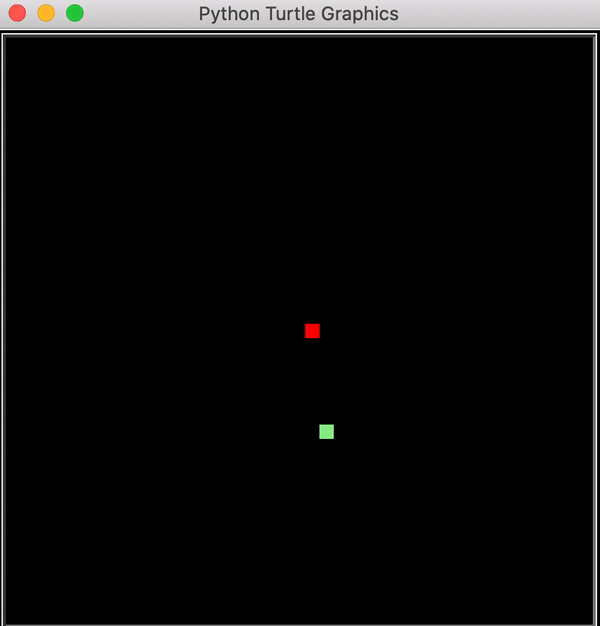
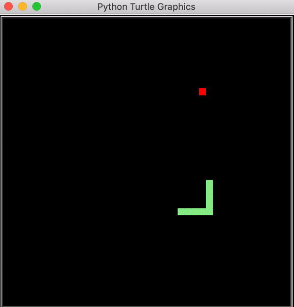

# Retro Snake Game

This repository contains a classic Snake game implemented in Python using the Turtle graphics library and the `freegames` module. Below you will find an introduction to the game, gameplay instructions, and a preview of the game in action.

## Table of Contents

- [Introduction](#introduction)
- [Installation](#installation)
- [Usage](#usage)
- [Gameplay](#gameplay)
- [Exercises](#exercises)
- [License](#license)

## Introduction

Welcome to the Retro Snake Game! This classic arcade game challenges you to control a snake and eat food while avoiding collisions with the boundaries and yourself.

### Gameplay Preview

**Snake Movement and Eating**

Below is a GIF showing the snake moving and eating the red food. Adjusted size for better display:



**Game Over Scenarios**

Here is a GIF demonstrating what happens when the snake hits the boundary or itself:



## Installation

To run the Snake game, you need to have Python installed on your system. You also need to install the `freegames` module. Follow these steps to set up your environment:

1. **Clone the Repository:**
   ```sh
   git clone https://github.com/your-username/retro-snake-game.git
   cd retro-snake-game
   ```

2. **Create a Virtual Environment:**
   ```sh
   python3 -m venv venv
   ```

3. **Activate the Virtual Environment:**
   - On macOS and Linux:
     ```sh
     source venv/bin/activate
     ```
   - On Windows:
     ```sh
     venv\Scripts\activate
     ```

4. **Install Dependencies:**
   ```sh
   pip install freegames
   ```

## Usage

To start the Snake game, run the `snake.py` file:

```sh
python snake.py
```

## Gameplay

Use the arrow keys to control the snake:
- `Right Arrow`: Move right
- `Left Arrow`: Move left
- `Up Arrow`: Move up
- `Down Arrow`: Move down

The objective is to eat the food (red square) that appears randomly on the screen. Each time the snake eats the food, it grows in length. The game ends if the snake runs into the walls or itself.

## Exercises

Here are some exercises to enhance the Snake game:

1. **Make the snake faster or slower:** Adjust the `ontimer(move, 100)` line to a different value.
2. **Make the snake go around the edges:** Modify the `inside(head)` function to allow the snake to wrap around the edges.
3. **Move the food:** Implement a function to randomly move the food to different locations periodically.
4. **Respond to mouse clicks:** Change the snake's direction or other behaviors based on mouse clicks.

## License

This project is licensed under the [Apache 2.0 License](LICENSE). See the `LICENSE` file for details.

---

Feel free to fork this repository and make improvements. Pull requests are welcome!
```